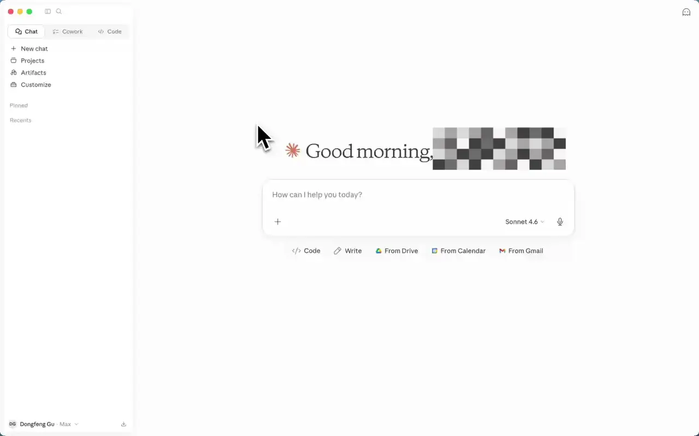

# Bizkol Marketing Toolbox

A Claude Code / Cowork plugin that turns Claude into a marketing strategist for **merchant agencies** and **direct merchants** running campaigns through [Bizkol AI](https://bizkol.ai). Deeply integrated with the **Bizkol MCP** (`mcp.bizkol.ai`) for KOL/influencer campaign management, with full-funnel marketing intelligence layered on top.

> **What this plugin does**
> - Runs **KOL campaigns end-to-end** via the Bizkol MCP — discovery, shortlisting, outreach, performance.
> - Runs **SEO/GEO audits**, **competitor scans**, and **voice-of-customer research**.
> - Reviews **Shopify store performance** alongside paid + organic marketing for full attribution.
> - Drafts **content, email sequences, and full campaign plans**.
> - Works for both **agencies running Bizkol on behalf of clients** and **direct merchants** running their own brand.

---

## Install

This repo lives at **<https://github.com/Bizkol-AI/skills>**. Pick the install path for the surface you use:

- **[Claude Desktop](#install-on-claude-desktop)** — **Recommended.** Skills + MCP servers, driven by natural-language prompts. The default surface for marketing teams.
- **[Claude Code](#install-on-claude-code)** — Power-user path: adds `/kol-campaign`, `/kol-outreach`, etc. **slash commands** on top of the skills + MCP. Use this if you live in the terminal or an IDE.

Either path works on its own. If you use both, install on each independently.

---

### Install on Claude Desktop

Claude Desktop (the standalone app at <https://claude.ai/download>) is the recommended surface for most marketing users. The plugin installs through Claude's **Cowork** marketplace — a few clicks, no JSON config, no terminal.



#### Step 1 — Add the Bizkol marketplace

1. Download and install Claude Desktop from <https://claude.ai/download>.
2. Open the **Cowork** tab.
3. Click the **Customize** tab.
4. Under **Personal Plugins**, click the **+** sign.
5. Select **Create plugin** → **Add marketplace**.
6. Paste the GitHub URL and confirm:

   ```
   https://github.com/Bizkol-AI/skills.git
   ```

#### Step 2 — Install the Bizkol plugin

1. In the **Directory**, select **Personal Plugins**.
2. Open the **Skills** tab.
3. Install the **Bizkol** plugin.

#### Step 3 — Connect the MCP connectors

After the plugin is installed, click **Connector** under Bizkol and authorize the integrations:

- **`bizkol`** — ✅ Required. Powers every KOL workflow.
- **`shopify`**, **`windsor`**, **`semrush`**, **`canva`** — Optional, but strongly recommended. Each one unlocks more analysis surface (commerce data, paid/owned analytics, SEO, creative). See [Bundled connectors](#bundled-connectors) for what each one does.

Each connector authorizes independently via OAuth on first use — sign in at <https://bizkol.ai> first if you haven't.

#### Step 4 — Use it

In a Desktop chat, describe what you want in plain language. The skills route the request:

> "Onboard a new client at acme.com — run pre-research, draft the brief, set up the folder structure."

> "Pull the email inbox for the Acme Spring campaign — show me what came in today and draft replies."

Output files (briefs, audits, drafts) write to the `/clients/[client-name]/` folder Claude has filesystem access to.

---

### Install on Claude Code

[Claude Code](https://docs.claude.com/en/docs/claude-code/plugins) gets you everything Desktop does, **plus** the `/kol-campaign`, `/kol-outreach`, `/competitor-scan`, … slash commands, and one-shot install/update via the plugin marketplace.

#### Option 1 — Install from the marketplace (recommended)

Inside Claude Code, add the Bizkol marketplace and install the plugin:

```shell
/plugin marketplace add Bizkol-AI/skills
/plugin install bizkol@bizkol-skills
/reload-plugins
```

Verify it loaded:

```shell
/plugin
```

You should see `bizkol` under the **Installed** tab. Skills are namespaced by the plugin — e.g. `/bizkol:kol-campaign`.

To update later:

```shell
/plugin marketplace update bizkol-skills
/reload-plugins
```

This works across every Claude Code surface — CLI, desktop app, web app, and the IDE extensions (VS Code, JetBrains).

#### Option 2 — Local development (`--plugin-dir`)

If you've cloned the repo and want to test changes without going through the marketplace:

```bash
git clone https://github.com/Bizkol-AI/skills.git
claude --plugin-dir ./skills
```

In this mode skills are loaded directly from your working copy, and `/reload-plugins` picks up edits without restarting Claude.

#### Connect Bizkol MCP

The plugin ships with `.mcp.json` pointing at `https://mcp.bizkol.ai/api/mcp`. The first time you run a Bizkol command, Claude triggers the OAuth flow in your browser — one click and you're in. Sign in or create an account at <https://bizkol.ai> first if you haven't already.

---

## Connect your Bizkol account

The **Bizkol MCP** at `https://mcp.bizkol.ai/api/mcp` is the heart of this plugin. It exposes everything you need to run campaigns: `create_campaign`, `search_kols`, `import_kols_to_campaign_by_username`, `get_campaign_kols`, `list_email_conversations`, and more — see [CONNECTORS.md](CONNECTORS.md#bizkol-mcp) for the full tool list.

Sign in or create an account at <https://bizkol.ai>, then run any Bizkol command — Claude will trigger the OAuth flow on first use.

---

## Bundled connectors

The plugin's `.mcp.json` wires up four MCP servers out of the box. Only `bizkol` is required; the rest are optional and authorize independently via OAuth on first use.

| MCP | Required | Used for |
|-----|----------|----------|
| **`bizkol`** (`mcp.bizkol.ai/api/mcp`) | ✅ Required | KOL discovery, campaign creation, outreach, performance — every KOL workflow |
| **`shopify`** (`setup.shopify.com/mcp`) | Optional | Merchant store data — orders, products, customers, sales, inventory — powers `/shopify-review` |
| **`windsor`** (`mcp.windsor.ai`) | Optional | Paid media performance — Google Ads, Meta Ads, GA4, GSC, GBP, Merchant — unified `get_data` tool. Falls back to Chrome → respective platform UI when not connected. |
| **`semrush`** (`mcp.semrush.com/v1/mcp`) | Optional | SEO + competitor intelligence — keywords, domain analytics, backlinks, SERP |
| **`canva`** (`mcp.canva.com/mcp`) | Optional | Creative asset generation — social graphics, ad creative |

**Browser fallback:** When an MCP isn't available for a job (e.g., Meta Ad Library, Google Ads Transparency Center, AI Overview spot-checks, review mining), commands fall back to Chrome browser automation.

**Graceful degradation:** Commands work with whatever is connected — they note missing connectors in the output and continue with the rest rather than failing.

See [CONNECTORS.md](CONNECTORS.md) for tool-by-tool reference.

---

## Commands

### KOL / Influencer marketing (Bizkol MCP)

- **`/kol-campaign [campaign-name]`** — End-to-end KOL campaign workflow: create the Bizkol campaign, search for relevant creators, shortlist, import by handle, track performance.
- **`/kol-discovery [topic or brand]`** — Discover creators on Instagram, TikTok, YouTube, or X by topic, follower range, and engagement rate. Returns shortlist with social handles and sample content.
- **`/kol-outreach [client-name] [campaign-name]`** — Manage email outreach for a campaign. Pulls every conversation (paginated, scales to 500+ KOLs), drafts replies for new inbound since the last run, and persists per-thread state so reruns only act on net-new activity. Idempotent — safe to run ad-hoc or on a daily cron via `/schedule`.
- **`/kol-performance [campaign-name]`** — Pull the campaign's per-KOL roster and posts via Bizkol, then aggregate client-side into a dashboard view: totals, platform breakdown, top posts, underperformers, per-KOL performance.

### Client / brand management

- **`/new-client [name]`** — Onboard a new client (agencies) or set up your own brand (in-house). Guided Q&A, brief generation, folder structure, initial audit. **Run this first — every other command requires the client folder to exist.**

### Ad-hoc research

- **`/seo-audit [client-name]`** — Full SEO + GEO audit. Domain health, rankings, backlinks, content gaps, technical spot-check, SERP/AI Overview analysis.
- **`/competitor-scan [client-name]`** — Competitor sweep. SEO comparison, ad creative, social presence, KOL partnerships, reviews, press.
- **`/shopify-review [client-name]`** — Commerce review. Revenue + AOV trend, top/bottom SKUs, customer cohorts, inventory health, marketing × commerce attribution.
- **`/reddit-research [topic-or-client]`** — Voice-of-customer research via Reddit. Pain points, decision criteria, customer language for copy. Topic-only mode supported.
- **`/gtm-research [client-or-topic]`** — Go-to-market research. Demand validation, channel strategy, 90-day launch plan. Topic-only mode supported.

### Content & strategy

- **`/campaign-plan [client-name]`** — Full campaign brief: objectives, audience, channels, content calendar, budget, success metrics. Integrates KOL strategy where relevant.
- **`/draft-content [client-name]`** — Draft blog posts, social copy, email newsletters, landing pages, press releases, case studies.
- **`/email-sequence [client-name]`** — Multi-email sequences for nurture, onboarding, re-engagement. Includes timing, subject lines, body, benchmarks.
- **`/brand-review`** — Review content against brand voice, style rules, messaging pillars. Severity-rated flags + suggested fixes.

---

## Skills

The toolbox is organized as **eight focused skills** that commands compose. The first one is the always-load-first operating manual; the others are loaded on demand for specialist work.

| Skill | Purpose |
|-------|---------|
| **`marketing-framework`** | Always-load-first. Tool priority, data-first rule, graceful degradation, folder layout, new-client prerequisite, Bizkol-native campaign rule, skill index. |
| **`kol-operations`** | All Bizkol MCP workflows — discovery, campaigns, outreach, performance. |
| **`gtm-research`** | New-client onboarding + GTM strategy + 90-day launch plans. |
| **`seo-geo`** | Traditional SEO + Generative Engine Optimization audits and reviews. |
| **`paid-media`** | Paid advertising — Google, Meta, etc. — strategy, performance, creative. |
| **`shopify-commerce`** | Shopify store analytics — orders, products, customers, inventory, AOV/LTV, marketing × commerce attribution. |
| **`competitor-research`** | Competitor teardowns + Reddit / forum / community VoC research. |
| **`content-brand`** | Drafting marketing content + brand voice review and enforcement. |

---

## Folder layout per client

Every client (agency mode) or brand (merchant mode) lives at `/clients/[client-name]/`.

```
/clients/[client-name]/
  client-brief.md          ← Single source of truth — brand, ICP, voice,
                              Windsor account IDs, Bizkol campaign index
  /raw-data/               ← Every raw data pull, dated; never overwritten
    /seo/                  ← Semrush + GSC pulls
    /competitor/           ← Competitor deep-dives, ad library, press
    /voc/                  ← Reddit, social listening, reviews
    /analytics/            ← GA4, GBP
    /paid/                 ← Google Ads, Meta Ads
    /commerce/             ← Shopify orders, products, customers, Merchant
    /kol/                  ← Optional Bizkol API archival
  /audits/                 ← Finished analyses (one file per run, dated)
                              initial-audit, seo-audit, competitor-scan,
                              voc-research, paid-review, commerce-review,
                              brand-review, kol-performance, kol-discovery
  /plans/                  ← Strategy + planning docs
                              gtm-plan, campaign-plan, kol-campaign-brief
  /content/
    /drafts/               ← blog, social, landing, press, case study, outreach
    /sequences/            ← multi-email sequences
```

**Bizkol KOL campaigns are not stored locally** — they live in Bizkol's database and are pulled live via the MCP (`get_campaign`, `get_campaign_kols`). The local `client-brief.md` keeps a campaign **index** (campaign-name → Bizkol `campaignId`); generated artifacts (performance snapshots, outreach drafts, discovery shortlists) land in `/audits/`, `/content/drafts/`, etc. as one-off, dated files.

---

## Operating principles

1. **Bizkol-first for KOL work.** Always use Bizkol MCP tools (`search_kols`, `create_campaign`, `get_campaign_kols`, etc.) rather than scraping social platforms manually. Social scrapers (Instagram, TikTok, YouTube, X) are fallbacks for creators who aren't yet in the Bizkol DB.
2. **Windsor for owned analytics.** GA4, GSC, Google Ads, Meta Ads, GBP, and Merchant data come from Windsor — never use Chrome browser when Windsor is connected.
3. **Chrome for competitor research only.** Meta Ad Library, Google Ads Transparency Center, competitor sites, and reviews — never for the client's own data.
4. **Data-first, then analysis.** Complete all data collection before drawing conclusions. Every recommendation cites specific data points.
5. **Raw data is preserved.** Every data pull is saved before analysis so source data is never lost.
6. **Graceful degradation.** If a connector is missing, the command notes it and continues with what's available.

---

## Versioning & contributing

This plugin is open source under <https://github.com/Bizkol-AI/skills>. Issues and PRs welcome.

- Report bugs: <https://github.com/Bizkol-AI/skills/issues>
- Request features: open a discussion in the repo
- Customize for your team: fork the repo and tweak commands, brand colors, and connector mappings to match your stack
